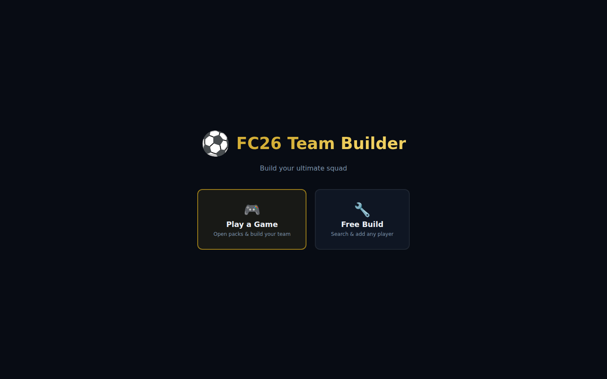
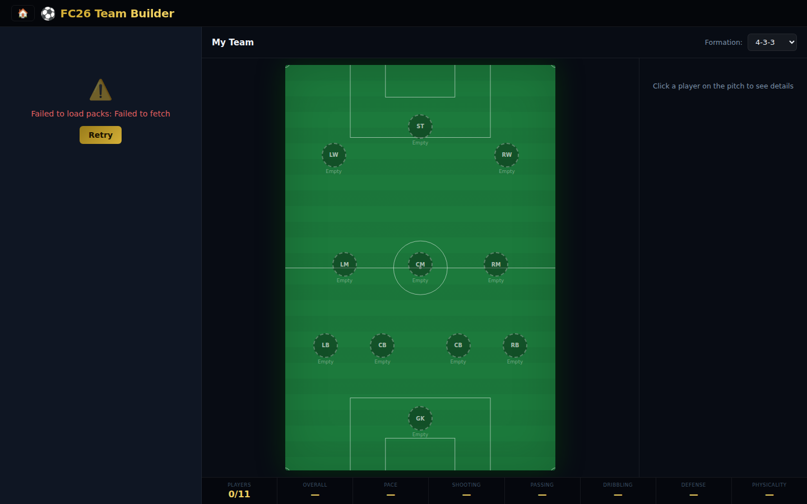
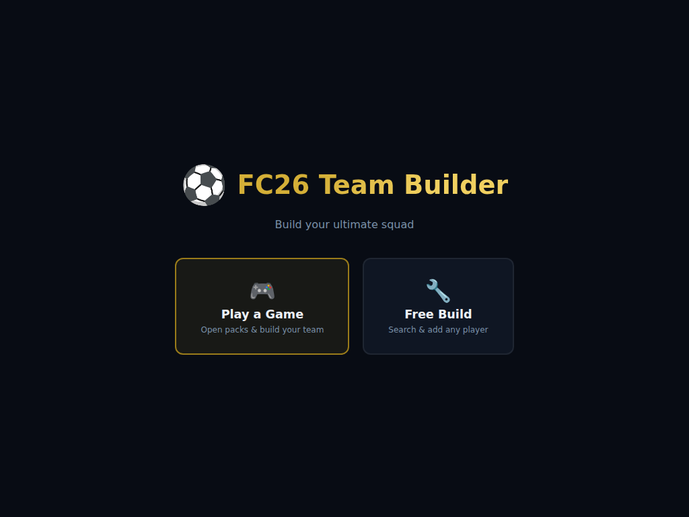
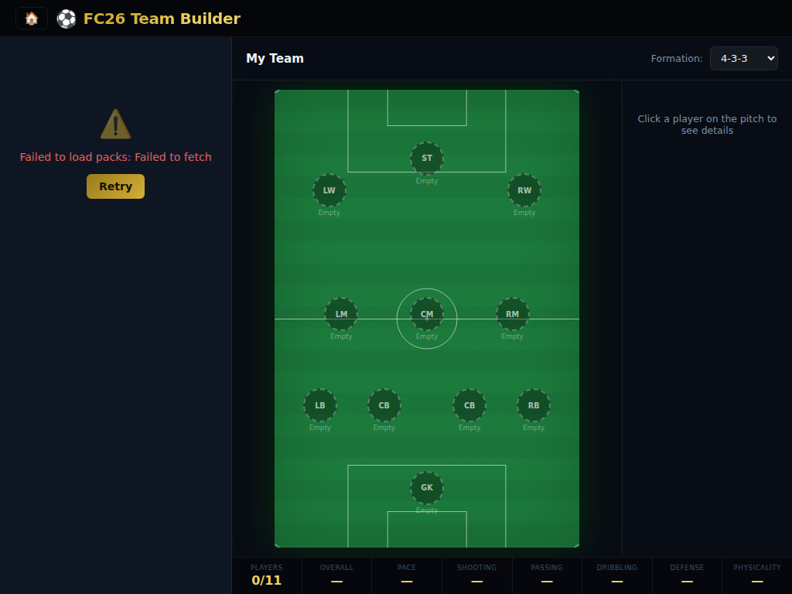
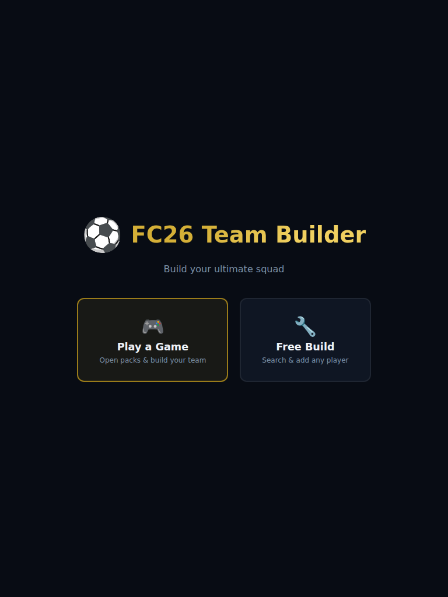
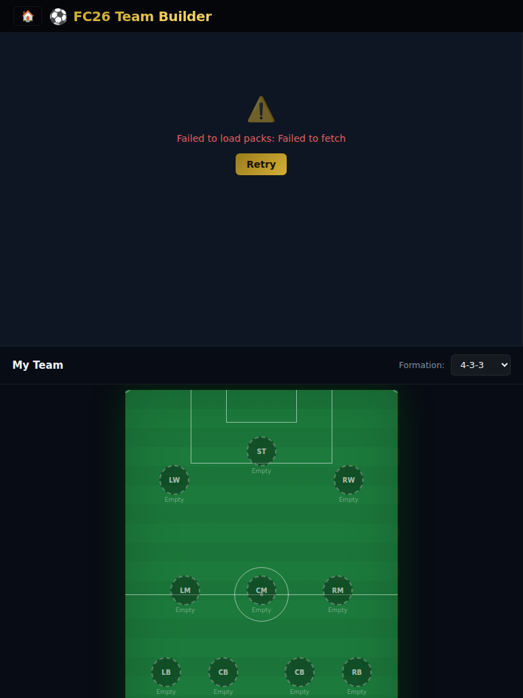
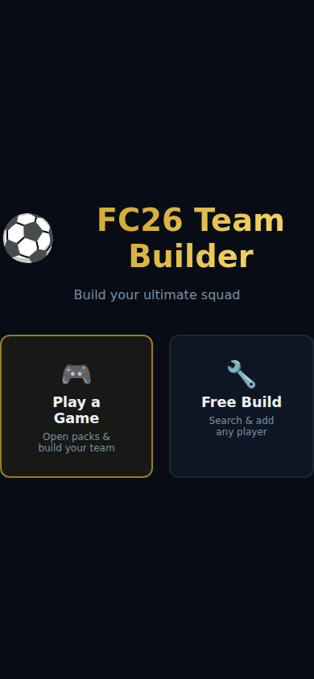
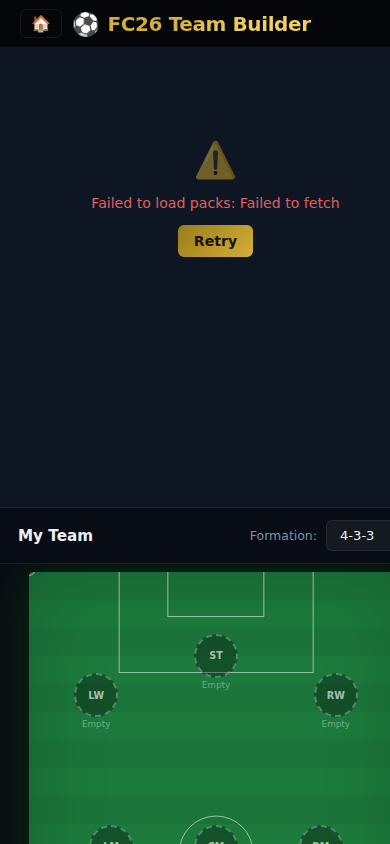

# ⚽ FC26 Team Builder

A football team builder powered by FC26 player data. Search for real EA Sports FC 26 players, see their actual in-game cards, and assemble an 11-player squad on a visual pitch.

**No sign-up or API key required** — just open `index.html` and start building.

---

## Game Modes

On launch you're presented with two modes:

### 🎮 Play a Game (Pack Opening)

Open card packs and build your team from the players you pull — just like a real pack-opening experience.

- **5 packs** of 8 cards each (40 cards total)
- **1 Platinum pack** (💎) containing 8 elite players (top 200 ranked)
- **4 Normal packs** each containing 7 random players + 1 elite player
- Open packs one at a time — cards are revealed with an animation
- Once all packs are opened, an **"All"** view lets you browse every card together
- Filter cards by **position** (individual or group) and **tier** (Gold 75+, Silver 65–74, Bronze &lt;65)
- Click a card to add it to your squad; displaced players are returned to the current pack
- Track progress with the status bar (positions filled / packs opened)

### 🔧 Free Build

Search the full FC26 database and add any player you want — no restrictions.

- 🔍 **Three ways to find players** — by exact name, by club, or by global rank
- Filter search results by position

---

## Features (both modes)

- 🃏 **Real EA FC26 card images** for every player
- 🏟️ **Visual pitch** — top-down view with pitch markings
- 📋 **5 formations** — 4-3-3 · 4-4-2 · 3-5-2 · 4-2-3-1 · 5-3-2
- 🎯 **Smart auto-assign** — players are placed in the best-matching position slot
- 📌 **Manual slot selection** — click a slot first, then pick the player you want there
- 📊 **Team averages** bar — OVR, PAC, SHO, PAS, DRI, DEF, PHY
- 🔄 **Drag-and-drop** to rearrange players on the pitch

---

## Screenshots

### Desktop (1440×900)
| Start screen | Main view |
|---|---|
|  |  |

### iPad landscape (1024×768)
| Start screen | Main view |
|---|---|
|  |  |

### iPad portrait (768×1024)
| Start screen | Main view |
|---|---|
|  |  |

### Phone (390×844)
| Start screen | Main view |
|---|---|
|  |  |

---

## Quick Start

1. Open `index.html` in any modern browser — no server, no setup needed.

> If you see CORS errors (rare), serve with a simple local server:
> ```bash
> npx serve .
> # or
> python -m http.server 8080
> ```

---

## How to use

### Start screen

Choose **Play a Game** or **Free Build** from the start screen.

### Pack Opening (Game mode)

| Action | How |
|--------|-----|
| Open a pack | Click the pack button, then click **Open Pack** |
| Add card to squad | Click a card in the pack view |
| Filter cards | Use the **Position** and **Tier** dropdowns above the cards |
| Navigate packs | Click pack buttons at the top, or use **← Previous** / **Next →** |
| View all cards | After all packs are opened, click the **⭐ All** button |

### Free Build mode

| Action | How |
|--------|-----|
| Search by player name | Select **By Name** tab → enter the **full name** (e.g. `Erling Haaland`) → press Enter |
| Search by club | Select **By Team** tab → enter the official club name (e.g. `Liverpool`, `Real Madrid`) |
| Browse top-rated players | Select **Top Rated** tab → set a rank range → click **Load** |
| Add player to squad | Click any player card (auto-assigns to the best empty position slot) |

### Pitch controls (both modes)

| Action | How |
|--------|-----|
| Assign to a specific slot | Click a position slot on the pitch first (it highlights), then click a player card |
| Remove from squad | Hover over a slot on the pitch → click the red **✕** button |
| Rearrange players | Drag and drop players between pitch slots |
| Change formation | Use the **Formation** dropdown |
| Clear squad | Click **Clear** (asks for confirmation if squad is non-empty) |

---

## Data source

Player data and card images are served by the FC26 API at `https://api.msmc.cc/api/fc26`.  
Card artwork is © EA Sports / Electronic Arts.

---

## Tech stack

| Layer | Tech |
|-------|------|
| UI | Plain HTML5 + CSS3 + vanilla JS (ES2020) |
| Data | FC26 API (`api.msmc.cc`) |
| Build | None — open `index.html` directly |

---

## File structure

```
.
├── index.html     – app shell & start screen
├── style.css      – all styles (dark FC theme)
├── app.js         – shared core logic (API, pitch, formations, team state)
├── free-build.js  – search panel logic for Free Build mode
├── game.js        – pack-opening game mode logic
└── README.md      – this file
```

---

## Troubleshooting

| Problem | Solution |
|---------|---------|
| "Player not found" | The name search needs the **exact full name** (e.g. `Kylian Mbappé`, not `Mbappe`). Try the **By Team** tab instead |
| Team returns no results | Use the club's official full name (e.g. `Manchester City`, not `Man City`) |
| Card images not loading | Images are served from EA's CDN — a numbered fallback badge is shown if unavailable |
| CORS error | Serve via `npx serve .` instead of opening `index.html` directly |
